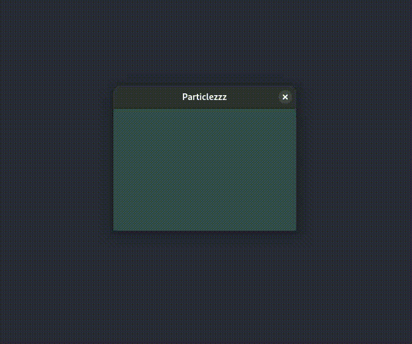

# Ballzzz Project

## Description
Ballzzz is a particle simulation project that bounces balls.

## Features
- Balls bounce off each other
- Ballzzz bounce off of wallzzz
- Balls React.js to window movements
- You can add more balls
- You can remove balls

## Prerequisites
- C++ compiler
- OpenGL
- GLFW
- GLEW

## Installation
To install and run the Ballzzz project, follow these steps:

1. Clone the repository:
    ```bash
    git clone https://github.com/kruczys/ballzzz.git
    ```
2. Navigate to the project directory:
    ```bash
    cd balzzz
    ```
3. Compile:
    ```bash
    make
    ```
4. Start the simulation:
    ```bash
    ./bin/main
    ```
5. Remove balls:
    ```
    make clean
    ```

## Usage
Use it however you want

## Video presentation
